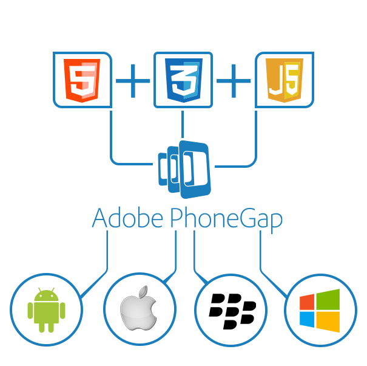

layout: true
class: black-slide

---

class: center, middle



---

# API

- Camera
- Device Info
- File
- File Transfer
- Dialogs(notification)
--

- Battery Status
- Device Motion(Accelerometer)
- Device Orientation(Compass)
- Geolocation
- Globalization
- InAppBrowser
- Media
- Media Capture
- Network Information
- Splash Screen
- Status Bar
- Whitelist
- Vibration

---

# Tools

- Phonegap CLI/Desktop
- Phonegap Mobile App

---

# Requirements

- Phonegap CLI

  - node.js
  - git

```bash
npm install -g phonegap@latest
```

---

# Platform Requirements

- Android

 - android sdk(cli)

---
class: center, middle
# Demo

---

my-ben changes

- service
- app

---

# Alternatives

- React Native
- Titanium
- NativeScript
- Xamarin
- Kony

---

# Reference


???

Presenter notes here
